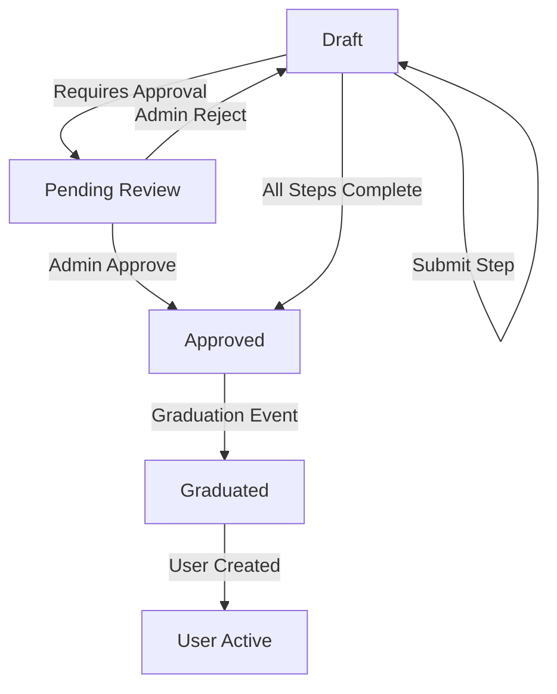

# Technical Specification: W3RD-Compliant Registration Protocol

**System Role:** Hypermedia Provider (Laravel Backend)  
**Consumer Role:** Distributed AHA Stack (Astro/HTMX/Alpine)  
**Protocol:** W3RD.io (Stateless Hypermedia over HTTPS)  
**Base Namespace:** `/htmx/v1/registration/`

---

## 1. Core Concept: The "Holding Pen"

The system utilizes a **"Deferred Identity"** pattern. No `User` record is created until a `Registration` entry clears the Workflow requirements defined by the specific `Client`. The backend serves HTML fragments (Hypermedia) that the remote AHA sites inject into their DOM.

---

## 2. Database Schema (MySQL)

**Versioning Strategy:** Workflows are immutable once active. To change a workflow, create a new `workflow` record (v2) and update the `client` configuration to point to the new ID. Existing registrations continue on their original `workflow_id`.

### 2.1 `workflows`
The high-level blueprint for a specific process (e.g., User Onboarding, Vendor Application).

| Field | Type | Description |
| :--- | :--- | :--- |
| `id` | BigInt (PK) | Internal Primary Key |
| `client_uuid` | UUID (Index) | Public ID of the Client (Tenant) |
| `name` | String | e.g., "Standard Onboarding", "VIP Intake" |
| `category` | String | Categorization (default: `registration`) |
| `is_active` | Boolean | Global toggle for this blueprint |
| `traffic_split` | JSON | A/B Testing Config (Feature #3) - e.g. `{"variant_b_id": 12, "ratio": 0.5}` |

### 2.2 `workflow_steps`
The atomic units of the workflow. Each represents a unique Blade fragment.

| Field | Type | Description |
| :--- | :--- | :--- |
| `id` | BigInt (PK) | Internal Primary Key |
| `workflow_id` | ForeignID | Parent Workflow ID |
| `slug` | String (Index) | URL identifier (e.g., `personal-info`, `id-upload`) |
| `type` | Enum | `form`, `kyc`, `gate`, `review`, `payment`, `info`, `enrichment`, `game` (Features #4, #10) |
| `blade_view` | String | Path to Blade file (e.g., `htmx.registration.steps.kyc`) |
| `logic_rule` | JSON | Conditional skip rules (Feature #1) |
| `risk_rule` | JSON | Dynamic risk-based injection rules (Feature #7) |
| `requires_approval`| Boolean | If true, triggers Feature #10 (Manual Review) |
| `sort_order` | Integer | Sequence within the workflow |

### 2.3 `registrations`
The state-machine table for in-progress applications.

**Indexing Strategy:**
*   **Compound Index:** `[client_id, email]` (Uniqueness check)
*   **Compound Index:** `[uuid, expires_at]` (Cleanup jobs)
*   **Index:** `parent_registration_uuid` (Team lookups)

| Field | Type | Description |
| :--- | :--- | :--- |
| `uuid` | UUID (PK) | W3RD Context ID (Used in all HTMX requests) |
| `client_id` | ForeignID | FK to the Clients table |
| `workflow_id` | ForeignID | The blueprint being followed |
| `current_step_id` | ForeignID | FK to workflow_steps |
| `email` | String | Captured email (Unique within Client scope) |
| `form_data` | JSON | Encrypted blob of all step inputs (#4, #5) |
| `step_timings` | JSON | Analytics: Time spent per step (Feature #2) |
| `status` | Enum | `draft`, `pending_review`, `approved`, `graduated` |
| `intended_role` | String | Target User Role (Feature #4) |
| `parent_registration_uuid`| UUID | For Team "Seat Holding" (Feature #9) |
| `approved_by` | ForeignID | Admin User ID who authorized graduation (#10) |
| `expires_at` | Timestamp | TTL for abandoned registrations |

---

## 3. The W3RD Protocol & URI Logic

### 3.1 Endpoint Mapping

All hypermedia requests follow this pattern:
`{BASE_URL}/htmx/v1/registration/{step_slug}`

*   **GET**: Fetches the fragment for the specific step. Requires `X-W3RD-Context` (Registration UUID).
*   **POST**: Submits data for the current step. Laravel processes data, updates `form_data` JSON, logs timing, and determines the next `step_slug`.

### 3.2 Happy Path Trace (Example)

**1. Start Registration (GET /init)**
```http
GET /htmx/v1/registration/init
Header: X-W3RD-Client: <uuid>
Response: 200 OK
New-Context-ID: <new-uuid>
HTML: <form hx-post="personal-info">...</form>
```

**2. Submit Info (POST /personal-info)**
```http
POST /htmx/v1/registration/personal-info
Header: X-W3RD-Context: <uuid>
Body: email=bob@example.com&name=Bob
Response: 200 OK
HX-Push-Url: /register/team-invite
HTML: <form hx-post="team-invite">...</form>
```

### 3.3 W3RD Header Requirements

| Header | Requirement | Purpose |
| :--- | :--- | :--- |
| `X-W3RD-Client` | **Mandatory** | The `client_uuid` of the requesting site |
| `X-W3RD-Context` | **Mandatory** | The `registration_uuid` (Context ID) |
| `HX-Request` | **Mandatory** | Ensures the request is from HTMX |
| `HX-Trigger` | Optional (Response) | Triggers Alpine.js events on the AHA frontend |

---

## 4. Functional Logic Specifications

### 4.0 Lifecycle State Machine



### 4.1 Feature #1 & #7: Conditional & Risk-Based Logic
Before serving a fragment, the `WorkflowEngine` evaluates both `logic_rule` and `risk_rule`.

*   **Logic Rule**: `{"field": "intended_role", "operator": "==", "value": "vendor"}` (Skips irrelevant steps)
*   **Risk Rule (Feature #7)**: `{"provider": "MaxMind", "score": ">", "threshold": 80}`
    *   **Behavior**: If the risk score of the incoming IP/Request is high, the engine *dynamically injects* a `verification-gate` step (CAPTCHA/SMS) that is otherwise bypassed for safe traffic.

### 4.2 Feature #4, #5 & #9: Branching and Team Provisioning
*   **Branching**: The workflow can branch based on `intended_role`.
*   **Team Seat Holding (Feature #9)**:
    *   If `form_data.invited_team` is populated, the backend immediately creates "Child Registrations" for each invitee in `draft` status, linked via `parent_registration_uuid`.
    *   Trigger `registration.team_invite_sent` webhook to dispatch emails.
    *   Invitees enter their own "Holding Pen" flow, pre-linked to the Organization being created.

### 4.3 Feature #10: Manual Review (Hypermedia Hold)
If a step is flagged `requires_approval`:
1.  The backend updates `registration.status` to `pending_review`.
2.  The response is a "Review in Progress" Blade fragment.
3.  The fragment uses `hx-get` with a `trigger="every 10s"` to poll the backend.
4.  Once an Admin approves, the next poll returns the "Success/Graduation" fragment.

### 4.4 Feature #4: Data Enrichment (Invisible Step)
*   **Step Type**: `enrichment`
*   **Behavior**: Asynchronous server-side process triggered after Email capture.
*   **Action**: Queries external providers (Clearbit/FullContact).
*   **Result**: Merges returned company/profile data into `form_data`. Subsequent steps (e.g., "Company Info") render with fields pre-filled, reducing user friction.

---

## 5. Security, Analytics & Graduation

### 5.1 feature #2: Step-Level Analytics
*   **Tracking**: `registrations.step_timings` stores `{ "step_slug": { "viewed_at": "timestamp", "completed_at": "timestamp" } }`.
*   **Insight**: Allows calculation of "Time to Complete" per step and identification of bottleneck steps with high abandonment rates.

### 5.2 Feature #1: Magic Link Session Restoration
*   **Endpoint**: `POST /htmx/v1/registration/magic-link`
*   **Action**: Generates a signed URL containing the `registration_uuid`.
*   **Behavior**: Clicking the link sets the `X-W3RD-Context` on the frontend (via LocalStorage/Cookie) and redirects the user to their last active `current_step_id`, enabling cross-device completion.

### 5.3 feature #6: Webhook Pulse Events
The Workflow Engine emits events to the Client's configured Webhook URL:
*   `registration.started` (Lead created)
*   `registration.step_completed` (Progress update, includes `step_slug`)
*   `registration.abandoned` (Trigger re-engagement email)
*   `registration.graduated` (Conversion event)

### 5.4 Feature #8: White-Label Styling
*   **Implementation**: All Blade fragments utilize Tailwind CSS utility classes.
*   **Customization**: The `Client` model stores a `theme_config` JSON (e.g., `{"primary": "#ff0000", "font": "Inter"}`).
*   **Injection**: The API response injects a `<style>` block scoped to the component with CSS variables mapping the Client's theme to Tailwind defaults (e.g., `--color-primary: #ff0000;`).

### 5.5 Feature #10: Gamified Interactive Steps
*   **Step Type**: `game`
*   **Behavior**: Returns a fragment containing an Alpine.js game component (e.g., "Select Avatar").
*   **Interface Contract**: The game component MUST mimic a form submission.
    1.  User plays game (e.g., selects avatar).
    2.  Game updates a hidden input `<input type="hidden" name="game_result" value="{id: 5}">`.
    3.  Game triggers `htmx.trigger('#game-form', 'submit')`.
    4.  Backend validates the `game_result` payload.

---

## 6. Graduation & Handover

### 6.1 Promotion to User (Graduation)
The "Promotion" is an atomic transaction:
1.  Validate that all required steps in the Workflow are marked as complete in `form_data`.
2.  Map `form_data` keys to `User` and `Profile` table columns.
3.  Create `User` record(s).
4.  Delete or Archive the `Registration` record (or mark as `graduated`).

### 6.2 W3RD Handover
Post-graduation, the backend returns a final fragment containing a **one-time-use Handover Token**.
*   **Mechanism**: Signed JWT (short-lived, 5 mins).
*   **Frontend Action**: Javascript detects token, POSTs to `/api/login/handover`.
*   **Result**: Backend exchanges token for long-lived Session/Auth Token.

---

## 7. Error Handling

### 7.1 Error Response Codes

| Code | Reason | Frontend Action |
| :--- | :--- | :--- |
| **422** | Validation Error | Render HTML fragment with error messages inline. |
| **403** | Expired Context | Trigger `registration-expired` event (Restart flow). |
| **409** | Conflict | Step already completed or out of sequence. Reload current step. |
| **500** | System Error | Show "Try again later" toast. |

### 7.2 Custom Headers
*   `X-W3RD-Error: logic-rule-mismatch` - Debug info for why a step was skipped.

---

## 8. Consumer Integration

To integrate the W3RD consumer on an Astro/Static site:

```html
<div id="w3rd-registration-container" 
     hx-get="https://api.w3rd.tech/htmx/v1/registration/init" 
     hx-trigger="load"
     hx-headers='{"X-W3RD-Client": "YOUR_CLIENT_UUID"}'>
</div>

<script>
    document.body.addEventListener('htmx:configRequest', function(evt) {
        // Automatically attach Context UUID if exists
        const context = localStorage.getItem('w3rd_context');
        if (context) {
            evt.detail.headers['X-W3RD-Context'] = context;
        }
    });

    document.body.addEventListener('htmx:afterRequest', function(evt) {
        // Save new Context UUID from response
        const newContext = evt.detail.xhr.getResponseHeader('New-Context-ID');
        if (newContext) localStorage.setItem('w3rd_context', newContext);
    });
</script>
```

---

## 9. Development & Testing

*   **Testing Strategy**: Use `Symfony\Component\DomCrawler\Crawler` in PHPUnit features tests to assert that specific input fields are present in the returned HTML. Do not just assert 200 OK.
*   **Mocking**: In local dev, mock the Enrichment and Risk providers to always return "Safe" / "Enriched" data.

---

## 10. Appendix: JSON Configuration Examples

**A. Logic Rule (Conditional Skip)**
```json
[
  {
    "field": "intended_role",
    "operator": "in",
    "value": ["vendor", "partner"]
  }
]
```

**B. Risk Rule (Verification Injection)**
```json
{
  "provider": "maxmind",
  "score_threshold": 75,
  "action": "inject_step",
  "step_slug": "identify-verification"
}
```

**C. Traffic Split (A/B Testing)**
```json
{
  "variants": [
    { "workflow_id": 12, "weight": 50 },
    { "workflow_id": 15, "weight": 50 }
  ]
}
```
