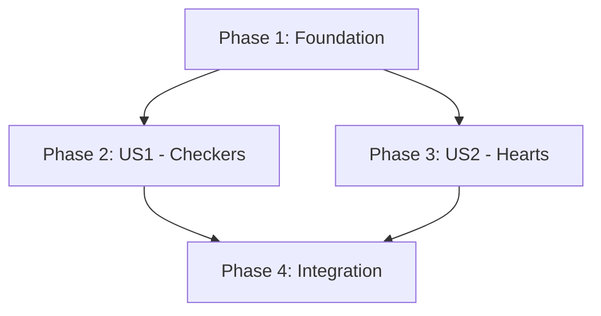

# Task Plan: Add Checkers and Hearts Game Titles

This document outlines the development tasks for implementing the Checkers and Hearts game titles.

## Phase 1: Foundational Framework

These tasks establish the core contracts and base classes required for the extensible game framework.

- [X] T001 Create interface `app/Interfaces/GameModeContract.php`.
- [X] T002 Create abstract class `app/GameTitles/BaseCardGameTitle.php` for shared card game logic.
- [X] T003 Create directory `app/GameTitles/Checkers/Modes` for Checkers game modes.
- [X] T004 Create directory `app/GameTitles/Hearts/Modes` for Hearts game modes.
- [X] T005 Create test file `tests/Feature/Games/CheckersTest.php`.
- [X] T006 Create test file `tests/Feature/Games/HeartsTest.php`.

## Phase 2: User Story 1 - Checkers Implementation (P1)

**Goal**: Implement a complete, playable game of standard Checkers.
**Independent Test**: Two players can start, play, and finish a game of Checkers, with the correct winner declared.

- [X] T010 [US1] Create data object `app/GameTitles/Checkers/PlayerState.php` as defined in the data model.
- [X] T011 [US1] Create data object `app/GameTitles/Checkers/GameState.php` as defined in the data model.
- [X] T012 [US1] Create class `app/GameTitles/Checkers/CheckersTitle.php` that implements `App\Interfaces\GameTitleContract`.
- [X] T013 [US1] Create class `app/GameTitles/Checkers/Modes/Standard.php` that implements `App\Interfaces\GameModeContract`.
- [X] T014 [US1] Implement the Checkers game logic and assertions in `tests/Feature/Games/CheckersTest.php`.
- [X] T015 [US1] Implement the Checkers API endpoint tests in `tests/Feature/Api/Games/CheckersTest.php`.

## Phase 3: User Story 2 - Hearts Implementation (P2)

**Goal**: Implement a complete, playable game of standard Hearts.
**Independent Test**: Four players can start, play through multiple rounds, and finish a game of Hearts, with scores calculated correctly and a winner declared.

- [ ] T016 [US2] Create data object `app/GameTitles/Hearts/PlayerState.php` as defined in the data model.
- [ ] T017 [US2] Create data object `app/GameTitles/Hearts/GameState.php` as defined in the data model.
- [ ] T018 [US2] Create class `app/GameTitles/Hearts/HeartsTitle.php` that implements `App\Interfaces\GameTitleContract` and extends `BaseCardGameTitle`.
- [ ] T019 [US2] Create class `app/GameTitles/Hearts/Modes/Standard.php` that implements `App\Interfaces\GameModeContract`.
- [ ] T020 [US2] Implement the Hearts game logic and assertions in `tests/Feature/Games/HeartsTest.php`.
- [ ] T021 [US2] Implement the Hearts API endpoint tests in `tests/Feature/Api/Games/HeartsTest.php`.

## Phase 4: Polish & Integration

These tasks finalize the feature by integrating the new games into the application.

- [ ] T022 Register `CheckersTitle` and `HeartsTitle` in the `config/protocol.php` configuration file.
- [ ] T023 Perform a final review of all new classes and tests for code quality and adherence to standards.

## Dependencies

- **US1 (Checkers)** and **US2 (Hearts)** can be developed in parallel after Phase 1 is complete.
- **Phase 4** depends on the completion of both Phase 2 and Phase 3.

## Parallel Execution

- **Within Phase 1**: Tasks T002, T003, and T004 can be executed in parallel.
- **Across Phases**: After Phase 1 is complete, Phase 2 (Checkers) and Phase 3 (Hearts) are independent and can be worked on simultaneously.

## Implementation Strategy

The implementation will follow a Test-Driven Development (TDD) approach. The MVP (Minimum Viable Product) for this feature is the completion of User Story 1 (Checkers), as it provides immediate value by adding a complete and playable game. User Story 2 (Hearts) can be delivered as a fast follow-up.
