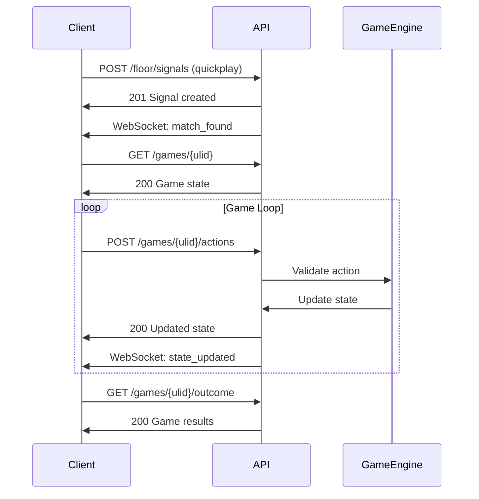

# Quickstart Guide: Production-Ready V1 API Structure

**Feature**: 008-api-structure | **Date**: November 20, 2025

## Overview

This quickstart guide helps developers understand and use the new v1 API structure with its 9 logical namespaces. This guide covers authentication, common workflows, and best practices.

## Table of Contents

1. [Getting Started](#getting-started)
2. [Authentication](#authentication)
3. [API Namespaces](#api-namespaces)
4. [Common Workflows](#common-workflows)
5. [Error Handling](#error-handling)
6. [Rate Limiting](#rate-limiting)
7. [Testing](#testing)
8. [Migration from Legacy Endpoints](#migration-from-legacy-endpoints)

## Getting Started

### Base URL

```
Production:  https://api.gamerprotocol.io/v1
Staging:     https://staging-api.gamerprotocol.io/v1
Local:       http://localhost:8000/v1
```

### Required Headers

Most API requests require two authorization headers:

```http
Authorization: Bearer <user-token>
X-Client-Key: <application-key>
```

- **Bearer Token**: User authentication (obtained from `/auth/login` or `/auth/register`)
- **X-Client-Key**: Application authorization (provided by GamerProtocol.io team)

### Content Type

All request and response bodies use JSON:

```http
Content-Type: application/json
Accept: application/json
```

## Authentication

### 1. Register New User

```http
POST /v1/auth/register
X-Client-Key: your-client-key

{
  "email": "player@example.com",
  "password": "SecurePass123!",
  "username": "ProPlayer"
}
```

**Response** (201 Created):
```json
{
  "message": "Registration successful. Please check your email to verify your account.",
  "email": "player@example.com"
}
```

### 2. Login

```http
POST /v1/auth/login
X-Client-Key: your-client-key

{
  "email": "player@example.com",
  "password": "SecurePass123!"
}
```

**Response** (200 OK):
```json
{
  "access_token": "1|abcdef123456...",
  "token_type": "Bearer",
  "expires_in": 31536000,
  "user": {
    "username": "ProPlayer",
    "email": "player@example.com",
    "avatar_url": null,
    "bio": null,
    "created_at": "2025-11-20T10:00:00Z"
  }
}
```

### 3. Social Authentication

```http
POST /v1/auth/social
X-Client-Key: your-client-key

{
  "provider": "google",
  "token": "google-oauth-token-here"
}
```

### 4. Logout

```http
POST /v1/auth/logout
Authorization: Bearer <token>
X-Client-Key: your-client-key
```

## API Namespaces

### 1. System & Webhooks

Platform health monitoring and external integrations.

**Check Service Health**:
```http
GET /v1/system/health
```

**Get Server Time**:
```http
GET /v1/system/time
```

**Get Platform Config**:
```http
GET /v1/system/config
```

### 2. Game Library

Browse and discover games before playing.

**List All Games**:
```http
GET /v1/library?pacing=turn_based&limit=20
```

**Get Game Details**:
```http
GET /v1/library/connect-four
```

**Get Game Rules**:
```http
GET /v1/library/connect-four/rules
```

**Get Game Assets** (for caching):
```http
GET /v1/library/connect-four/entities
```

### 3. Account Management

Manage user profile, progression, and alerts.

**Get Profile**:
```http
GET /v1/account/profile
Authorization: Bearer <token>
X-Client-Key: your-client-key
```

**Update Profile**:
```http
PATCH /v1/account/profile
Authorization: Bearer <token>
X-Client-Key: your-client-key

{
  "username": "NewUsername",
  "bio": "Competitive player focused on strategy games"
}
```

**Get Progression**:
```http
GET /v1/account/progression
Authorization: Bearer <token>
X-Client-Key: your-client-key
```

**Get Performance Records**:
```http
GET /v1/account/records?title_key=connect-four
Authorization: Bearer <token>
X-Client-Key: your-client-key
```

**Get Alerts**:
```http
GET /v1/account/alerts?unread_only=true
Authorization: Bearer <token>
X-Client-Key: your-client-key
```

**Mark Alerts as Read**:
```http
POST /v1/account/alerts/read
Authorization: Bearer <token>
X-Client-Key: your-client-key

{
  "alert_ids": ["01HQZ...", "01HQZ..."]
}
```

### 4. Floor Coordination

Find opponents through lobbies, quickplay, or direct challenges.

**Browse Lobbies**:
```http
GET /v1/floor/lobbies?title_key=connect-four&status=waiting
Authorization: Bearer <token>
X-Client-Key: your-client-key
```

**Create Lobby**:
```http
POST /v1/floor/lobbies
Authorization: Bearer <token>
X-Client-Key: your-client-key

{
  "title_key": "connect-four",
  "max_players": 2,
  "visibility": "public"
}
```

**Join Lobby**:
```http
POST /v1/floor/lobbies/01HQZ.../seat
Authorization: Bearer <token>
X-Client-Key: your-client-key
```

**Quickplay Matchmaking**:
```http
POST /v1/floor/signals
Authorization: Bearer <token>
X-Client-Key: your-client-key

{
  "title_key": "connect-four",
  "preferred_pace": "normal"
}
```

**Cancel Matchmaking**:
```http
DELETE /v1/floor/signals/01HQZ...
Authorization: Bearer <token>
X-Client-Key: your-client-key
```

**Send Challenge**:
```http
POST /v1/floor/proposals
Authorization: Bearer <token>
X-Client-Key: your-client-key

{
  "type": "challenge",
  "recipient_username": "OpponentName",
  "title_key": "connect-four"
}
```

**Accept Proposal**:
```http
POST /v1/floor/proposals/01HQZ.../accept
Authorization: Bearer <token>
X-Client-Key: your-client-key
```

### 5. Active Games

Play games with real-time state synchronization.

**List Your Games**:
```http
GET /v1/games?status=active
Authorization: Bearer <token>
X-Client-Key: your-client-key
```

**Get Game State**:
```http
GET /v1/games/01HQZDJ3K8M9N1P0Q2R4S6T8V0
Authorization: Bearer <token>
X-Client-Key: your-client-key
```

**Smart Sync** (get only changes):
```http
GET /v1/games/01HQZDJ3K8M9N1P0Q2R4S6T8V0?since=2025-11-20T12:00:00Z
Authorization: Bearer <token>
X-Client-Key: your-client-key
```

**Execute Action** (with idempotency):
```http
POST /v1/games/01HQZDJ3K8M9N1P0Q2R4S6T8V0/actions
Authorization: Bearer <token>
X-Client-Key: your-client-key
Idempotency-Key: 550e8400-e29b-41d4-a716-446655440000

{
  "action_type": "DROP_PIECE",
  "action_data": {
    "column": 3
  }
}
```

**Get Turn Timer**:
```http
GET /v1/games/01HQZDJ3K8M9N1P0Q2R4S6T8V0/turn
Authorization: Bearer <token>
X-Client-Key: your-client-key
```

**Get Timeline** (replay):
```http
GET /v1/games/01HQZDJ3K8M9N1P0Q2R4S6T8V0/timeline
Authorization: Bearer <token>
X-Client-Key: your-client-key
```

**Concede Game**:
```http
POST /v1/games/01HQZDJ3K8M9N1P0Q2R4S6T8V0/concede
Authorization: Bearer <token>
X-Client-Key: your-client-key
```

**Get Outcome**:
```http
GET /v1/games/01HQZDJ3K8M9N1P0Q2R4S6T8V0/outcome
Authorization: Bearer <token>
X-Client-Key: your-client-key
```

### 6. Economy

Manage balances, transactions, and subscriptions.

**Get Balance**:
```http
GET /v1/economy/balance
Authorization: Bearer <token>
X-Client-Key: your-client-key
```

**Get Transaction History**:
```http
GET /v1/economy/transactions?type=buy_in&limit=50
Authorization: Bearer <token>
X-Client-Key: your-client-key
```

**Buy-in to Game**:
```http
POST /v1/economy/cashier
Authorization: Bearer <token>
X-Client-Key: your-client-key

{
  "operation": "buy_in",
  "amount": 10.00,
  "game_ulid": "01HQZ..."
}
```

**Cash-out from Game**:
```http
POST /v1/economy/cashier
Authorization: Bearer <token>
X-Client-Key: your-client-key

{
  "operation": "cash_out",
  "amount": 15.00,
  "game_ulid": "01HQZ..."
}
```

**List Subscription Plans**:
```http
GET /v1/economy/plans
Authorization: Bearer <token>
X-Client-Key: your-client-key
```

**Verify Mobile Receipt**:
```http
POST /v1/economy/receipts/apple
Authorization: Bearer <token>
X-Client-Key: your-client-key

{
  "receipt_data": "base64-encoded-receipt"
}
```

### 7. Data Feeds

Subscribe to real-time event streams via Server-Sent Events (SSE). All feeds support optional query parameters for filtering.

**Live Games Feed**:
```javascript
// Stream public game activity (starts, moves, completions)
const gamesSource = new EventSource(
  'https://api.gamerprotocol.io/v1/feeds/games?title_key=chess',
  {
    headers: {
      'Authorization': 'Bearer <token>',
      'X-Client-Key': 'your-client-key'
    }
  }
);

gamesSource.addEventListener('game-update', (event) => {
  const data = JSON.parse(event.data);
  // { game_ulid, event_type, title_key, players, stakes, timestamp }
  console.log('Game event:', data);
});
```

**Win Announcements Feed**:
```javascript
// Stream player wins with outcomes and stakes
const winsSource = new EventSource(
  'https://api.gamerprotocol.io/v1/feeds/wins?min_stakes=10',
  {
    headers: {
      'Authorization': 'Bearer <token>',
      'X-Client-Key': 'your-client-key'
    }
  }
);

winsSource.addEventListener('win-announcement', (event) => {
  const data = JSON.parse(event.data);
  // { game_ulid, winner_username, winner_avatar, title_key, stakes, outcome, xp_earned, timestamp }
  console.log('Player won:', data);
});
```

**Leaderboard Updates Feed**:
```javascript
// Stream rank changes and high scores
const leaderboardSource = new EventSource(
  'https://api.gamerprotocol.io/v1/feeds/leaderboards?period=daily&title_key=chess',
  {
    headers: {
      'Authorization': 'Bearer <token>',
      'X-Client-Key': 'your-client-key'
    }
  }
);

leaderboardSource.addEventListener('leaderboard-update', (event) => {
  const data = JSON.parse(event.data);
  // { event_type, username, avatar, old_rank, new_rank, title_key, period, score, timestamp }
  console.log('Leaderboard change:', data);
});
```

**Tournament Progress Feed**:
```javascript
// Stream tournament events (rounds, brackets, eliminations)
const tournamentsSource = new EventSource(
  'https://api.gamerprotocol.io/v1/feeds/tournaments?tournament_ulid=01J3...',
  {
    headers: {
      'Authorization': 'Bearer <token>',
      'X-Client-Key': 'your-client-key'
    }
  }
);

tournamentsSource.addEventListener('tournament-event', (event) => {
  const data = JSON.parse(event.data);
  // { tournament_ulid, tournament_name, event_type, player_username, round_number, match_result, timestamp }
  console.log('Tournament update:', data);
});
```

**Challenge Activity Feed**:
```javascript
// Stream challenge lifecycle events
const challengesSource = new EventSource(
  'https://api.gamerprotocol.io/v1/feeds/challenges?title_key=connect-four',
  {
    headers: {
      'Authorization': 'Bearer <token>',
      'X-Client-Key': 'your-client-key'
    }
  }
);

challengesSource.addEventListener('challenge-update', (event) => {
  const data = JSON.parse(event.data);
  // { proposal_ulid, event_type, challenger_username, opponent_username, title_key, stakes, timestamp }
  console.log('Challenge activity:', data);
});
```

**Achievement Unlocks Feed**:
```javascript
// Stream platform-wide achievement unlocks
const achievementsSource = new EventSource(
  'https://api.gamerprotocol.io/v1/feeds/achievements?rarity=legendary',
  {
    headers: {
      'Authorization': 'Bearer <token>',
      'X-Client-Key': 'your-client-key'
    }
  }
);

achievementsSource.addEventListener('achievement-unlock', (event) => {
  const data = JSON.parse(event.data);
  // { achievement_key, achievement_name, description, rarity, username, avatar, title_key, timestamp }
  console.log('Achievement unlocked:', data);
});
```

**SSE Reconnection Pattern**:
```javascript
function connectWithReconnect(url, options) {
  let eventSource;
  let reconnectTimer;
  
  function connect() {
    eventSource = new EventSource(url, options);
    
    eventSource.addEventListener('open', () => {
      console.log('Feed connected');
      clearTimeout(reconnectTimer);
    });
    
    eventSource.addEventListener('error', () => {
      console.log('Feed disconnected, reconnecting...');
      eventSource.close();
      reconnectTimer = setTimeout(connect, 3000);
    });
    
    return eventSource;
  }
  
  return connect();
}
```

### 8. Competitions

Browse and enter tournaments.

**List Tournaments**:
```http
GET /v1/competitions?status=registration_open
Authorization: Bearer <token>
X-Client-Key: your-client-key
```

**Enter Tournament**:
```http
POST /v1/competitions/01HQZ.../enter
Authorization: Bearer <token>
X-Client-Key: your-client-key
```

**Get Tournament Structure**:
```http
GET /v1/competitions/01HQZ.../structure
Authorization: Bearer <token>
X-Client-Key: your-client-key
```

**Get Bracket**:
```http
GET /v1/competitions/01HQZ.../bracket
Authorization: Bearer <token>
X-Client-Key: your-client-key
```

**Get Standings**:
```http
GET /v1/competitions/01HQZ.../standings
Authorization: Bearer <token>
X-Client-Key: your-client-key
```

## Common Workflows

### Complete Game Flow



### 1. Quickplay Flow

```javascript
// 1. Submit matchmaking signal
const signal = await fetch('/v1/floor/signals', {
  method: 'POST',
  headers: authHeaders,
  body: JSON.stringify({
    title_key: 'connect-four',
    preferred_pace: 'normal'
  })
});

// 2. Wait for match (via WebSocket or polling)
// When matched, you'll receive game_ulid

// 3. Get initial game state
const game = await fetch(`/v1/games/${game_ulid}`, {
  headers: authHeaders
});

// 4. Play turns
const uuid = crypto.randomUUID();
const move = await fetch(`/v1/games/${game_ulid}/actions`, {
  method: 'POST',
  headers: {
    ...authHeaders,
    'Idempotency-Key': uuid
  },
  body: JSON.stringify({
    action_type: 'DROP_PIECE',
    action_data: { column: 3 }
  })
});

// 5. Get outcome when complete
const outcome = await fetch(`/v1/games/${game_ulid}/outcome`, {
  headers: authHeaders
});
```

### 2. Private Lobby Flow

```javascript
// Host creates lobby
const lobby = await fetch('/v1/floor/lobbies', {
  method: 'POST',
  headers: authHeaders,
  body: JSON.stringify({
    title_key: 'connect-four',
    max_players: 2,
    visibility: 'private'
  })
});

// Share join_code with friend

// Friend joins lobby
await fetch(`/v1/floor/lobbies/${lobby.ulid}/seat`, {
  method: 'POST',
  headers: authHeaders
});

// Host starts game (via WebSocket ready check)
// Both players redirected to game
```

### 3. Direct Challenge Flow

```javascript
// Send challenge
const proposal = await fetch('/v1/floor/proposals', {
  method: 'POST',
  headers: authHeaders,
  body: JSON.stringify({
    type: 'challenge',
    recipient_username: 'FriendName',
    title_key: 'connect-four'
  })
});

// Recipient accepts
const result = await fetch(`/v1/floor/proposals/${proposal.ulid}/accept`, {
  method: 'POST',
  headers: authHeaders
});

// Game created, both players redirected
const { game_ulid } = result;
```

### 4. Buy-in / Cash-out Flow

```javascript
// Check balance before buy-in
const balance = await fetch('/v1/economy/balance', {
  headers: authHeaders
});

// Buy-in to game
await fetch('/v1/economy/cashier', {
  method: 'POST',
  headers: authHeaders,
  body: JSON.stringify({
    operation: 'buy_in',
    amount: 10.00,
    game_ulid: game_ulid
  })
});

// Play game...

// Cash-out after game
await fetch('/v1/economy/cashier', {
  method: 'POST',
  headers: authHeaders,
  body: JSON.stringify({
    operation: 'cash_out',
    amount: 15.00,
    game_ulid: game_ulid
  })
});

// Check updated balance
const newBalance = await fetch('/v1/economy/balance', {
  headers: authHeaders
});
```

## Error Handling

### Standard Error Format

```json
{
  "message": "The given data was invalid.",
  "errors": {
    "email": ["The email field is required."],
    "password": ["The password must be at least 8 characters."]
  }
}
```

### HTTP Status Codes

| Code | Meaning | Example |
|------|---------|---------|
| 200 | OK | Successful GET, PATCH request |
| 201 | Created | Successful POST creating resource |
| 204 | No Content | Successful DELETE |
| 400 | Bad Request | Malformed JSON, missing required header |
| 401 | Unauthorized | Invalid or missing bearer token |
| 403 | Forbidden | Valid token but insufficient permissions |
| 404 | Not Found | Resource doesn't exist |
| 409 | Conflict | Lobby full, game already started |
| 422 | Unprocessable Entity | Validation errors, invalid move |
| 429 | Too Many Requests | Rate limit exceeded |
| 500 | Internal Server Error | Server-side error |
| 503 | Service Unavailable | Maintenance mode |

### Error Handling Example

```javascript
try {
  const response = await fetch('/v1/games/01HQZ.../actions', {
    method: 'POST',
    headers: {
      ...authHeaders,
      'Idempotency-Key': crypto.randomUUID()
    },
    body: JSON.stringify(action)
  });
  
  if (!response.ok) {
    if (response.status === 422) {
      const errors = await response.json();
      console.error('Invalid move:', errors.message);
      // Display specific error to user
    } else if (response.status === 401) {
      // Token expired, redirect to login
      window.location.href = '/login';
    } else {
      console.error('Unexpected error:', response.status);
    }
  }
  
  const game = await response.json();
  // Update UI with new game state
} catch (error) {
  console.error('Network error:', error);
  // Handle network failure
}
```

## Rate Limiting

API enforces rate limits to prevent abuse:

- **Anonymous**: 60 requests per minute
- **Authenticated**: 300 requests per minute
- **Game Actions**: 30 requests per minute per game

Rate limit headers are included in responses:

```http
X-RateLimit-Limit: 300
X-RateLimit-Remaining: 295
X-RateLimit-Reset: 1700000000
```

When rate limited (429 status):

```json
{
  "message": "Too many requests. Please try again later.",
  "retry_after": 60
}
```

## Testing

### Local Development

```bash
# Start Laravel development server
php artisan serve

# Base URL
http://localhost:8000/v1
```

### Postman Collection

Download the Postman collection: [GamerProtocol-API-v1.postman_collection.json]

Import into Postman and configure environment variables:
- `base_url`: Your API base URL
- `client_key`: Your application key
- `access_token`: User bearer token (auto-filled after login)

### cURL Examples

**Health Check**:
```bash
curl https://api.gamerprotocol.io/v1/system/health
```

**Login**:
```bash
curl -X POST https://api.gamerprotocol.io/v1/auth/login \
  -H "X-Client-Key: your-client-key" \
  -H "Content-Type: application/json" \
  -d '{
    "email": "player@example.com",
    "password": "password"
  }'
```

**Get Game State**:
```bash
curl https://api.gamerprotocol.io/v1/games/01HQZDJ3K8M9N1P0Q2R4S6T8V0 \
  -H "Authorization: Bearer your-token" \
  -H "X-Client-Key: your-client-key"
```

## Migration from Legacy Endpoints

The API maintains backward compatibility during the transition period. Legacy endpoints return deprecation headers:

```http
X-API-Deprecated: true
X-API-Deprecation-Date: 2026-06-01
X-API-Replacement: /v1/system/health
```

### Migration Mapping

| Legacy Endpoint | New Endpoint | Notes |
|----------------|--------------|-------|
| `GET /status` | `GET /v1/system/health` | Expanded response |
| `GET /time` | `GET /v1/system/time` | Unchanged |
| `GET /titles` | `GET /v1/library` | Renamed namespace |
| `GET /titles/{id}` | `GET /v1/library/{key}` | Uses key instead of ID |
| `GET /me/profile` | `GET /v1/account/profile` | Namespace change |
| `GET /me/stats` | `GET /v1/account/records` | Renamed for clarity |
| `GET /me/levels` | `GET /v1/account/progression` | Renamed for clarity |
| `GET /me/alerts` | `GET /v1/account/alerts` | Namespace change |
| `GET /games/lobbies` | `GET /v1/floor/lobbies` | New namespace |
| `POST /games/quickplay` | `POST /v1/floor/signals` | New approach |
| `POST /games/.../rematch` | `POST /v1/floor/proposals` | Unified proposals |
| `GET /games` | `GET /v1/games` | Unchanged |
| `GET /games/.../history` | `GET /v1/games/.../timeline` | Renamed |
| `POST /games/.../forfeit` | `POST /v1/games/.../concede` | Renamed (or `/abandon`) |
| `GET /billing/status` | `GET /v1/economy/balance` | New namespace |
| `GET /billing/plans` | `GET /v1/economy/plans` | Namespace change |
| `POST /billing/.../verify` | `POST /v1/economy/receipts/{provider}` | New structure |
| `POST /stripe/webhook` | `POST /v1/webhooks/stripe` | Generalized webhooks |

### Migration Strategy

1. **Phase 1** (Current - Dec 2025): Both old and new endpoints work
2. **Phase 2** (Jan - May 2026): Deprecation warnings logged and returned
3. **Phase 3** (Jun 2026+): Legacy endpoints return 410 Gone with migration instructions

## Best Practices

1. **Always use Idempotency-Key for game actions** to prevent duplicate moves
2. **Cache library responses** - game definitions don't change frequently
3. **Use smart sync** (`?since=` parameter) to reduce bandwidth
4. **Handle WebSocket disconnections** gracefully with polling fallback
5. **Implement exponential backoff** for retries on 5xx errors
6. **Store bearer tokens securely** - never in localStorage, use httpOnly cookies
7. **Monitor deprecation headers** and migrate proactively
8. **Test against staging environment** before production deployment

## Support

- **API Documentation**: https://docs.gamerprotocol.io
- **Support Email**: api@gamerprotocol.io
- **Discord**: https://discord.gg/gamerprotocol
- **Status Page**: https://status.gamerprotocol.io

## Next Steps

1. Review the [OpenAPI specification](./contracts/api.openapi.yaml) for complete API reference
2. Explore the [data model documentation](./data-model.md) for entity relationships
3. Read the [research document](./research.md) for architectural decisions
4. Check the [implementation plan](./plan.md) for development roadmap
